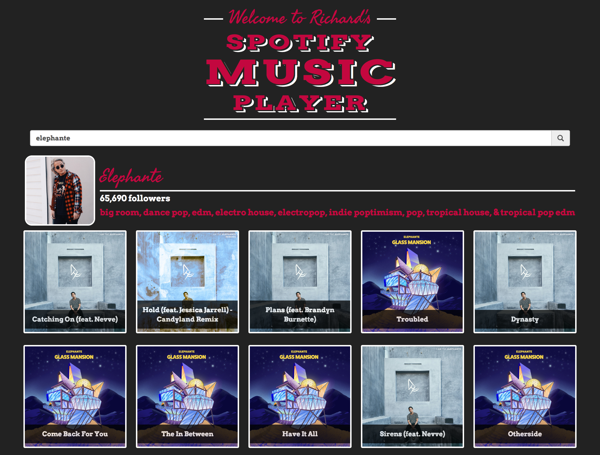

# Richard's Spotify Music Player
This is a intuitive and beautiful user interface allowing users to play their favorite music using Spotify's API through the oAuth 2.0 process.

## Visit deployed app
You can visit the app at https://richard-spotify-backend.herokuapp.com/login which will re-direct you to https://richard-spotify-music-player.herokuapp.com/ with the authorization token in the URL to play any song you'd like in Spotify's database using my personal API key.

## Images



## Build Setup for development mode

``` bash
# Install dependencies from root directory
npm install

# Create .env file to store Spotify API client id/ secret id
cp .env.example ./.env

# Go to https://developer.spotify.com/dashboard/login to log-in and create a web app.  Open your web app and click "edit settings" and add http://localhost:8888/callback to your Redirect URIs
https://developer.spotify.com/dashboard/login

# Replace YOUR_SPOTIFY_CLIENT_ID with your client ID and SPOTIFY_CLIENT_SECRET_ID with your client secret id
open .env

# Build app for production to the build folder
npm run build

# Runs the app in development mode at http://localhost:3000/
npm start

# In a new terminal write code below. This runs an express server to handle oAuth callback to Spotify's API back to our front-end
node server.js

# Open browser and go to http://localhost:8888/login which will automatically redirect you to the front-end with the authentication token to make API calls to Spotify
http://localhost:8888/login
```

## How the web app works with Spotify's Authentication process in development mode
> Make sure to follow build setup properly.  After you have the front end server and express server running in seperate terminals, you start by going to http://localhost:8888/login.  This express server will then hit a Spotify's authorization backend that has an understanding with Spotify's API.  Then Spotify will use our Redirect URI to hit our express server which will in turn send us back to our front-end at localhost:3000 with a temporary token in the URL thanks to our client id/ secret id.  Then our app will have full functionality thanks to this temporary token allowing us to fetch JSON data from Spotify's API.

